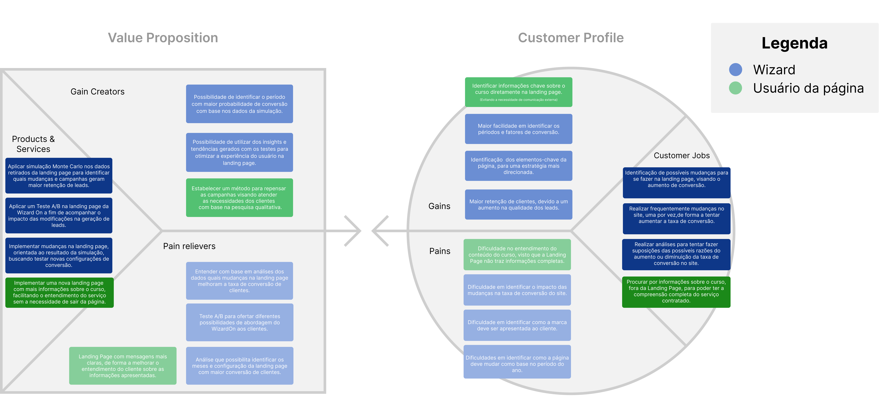

# Proposta de valor

O Canvas Proposta de Valor é uma ferramenta estratégica que facilita a abordagem prática, teste, visualização e aprimoramento constante de produtos e serviços. Isso ocorre ao compreender as necessidades, desejos e desafios dos parceiros e usuários, assegurando assim um alinhamento do produto com suas necessidades.

O CANVAS foi desenvolvido com base em dados coletados pelos usuários e os parceiros. As informações sobre os parceiros foram obtidas por meio do TAPI e de encontros diretos, enquanto as informações sobre os usuários foram coletadas durante uma pesquisa qualitativa conduzida pelo grupo.

É importante ressaltar que construímos duas perspectivas distintas da proposta de valor: uma sob a ótica da Wizard e outra sob a perspectiva do usuário final da página. A abordagem "Azul" é direcionada à Wizard, enquanto a abordagem "Verde" foca nas necessidades do usuário na página.

A seguir, apresenta-se a proposta de valor construída para o projeto:

Fonte: Autores

 

**Observação:** Caso a imagem não possibilite uma leitura adequada, <a href="https://www.figma.com/file/KVMo0sTuWTeVKCeEESlULw/proposta-de-valor-(magos-da-convers%C3%A3o)?type=design&node-id=0%3A1&mode=design&t=2kLtNw1z2kMsrOu9-1">acesse aqui</a> para abrir o arquivo no Figma. 

 

# Descrição - Value Propositon

||                                                                   |
|------------------|--------------------------------------------------------------------------------------------------------------------------------|
| **Produtos e Serviços** | **Objetivo** |
| Aplicar simulação Monte Carlo nos dados retirados da landing page para identificar quais mudanças e campanhas geram maior retenção de leads. | Identificar e coletar dados relevantes da landing page e campanhas. |
| Aplicar um Teste A/B na landing page da Wizard On a fim de acompanhar o impacto das modificações na geração de leads. | Acompanhar as métricas e resultados do Teste A/B. |
| Implementar mudanças na landing page, orientada ao resultado da simulação, buscando testar novas configurações de conversão. | Realizar ajustes na landing page com base nos insights da simulação. |
| Implementar uma nova landing page com mais informações sobre o curso, facilitando o entendimento do serviço sem a necessidade de sair da página. | Analisar o feedback dos usuários para aprimorar a nova landing page. |
| **Criadores de Ganho** | **Objetivo** |
| Possibilidade de identificar o período com maior probabilidade de conversão com base nos dados da simulação. | Otimizar o momento de investimento em campanhas para aumentar a conversão. |
| Possibilidade de utilizar dos insights e tendências gerados com os testes para otimizar a experiência do usuário na landing page. | Melhorar a eficácia das estratégias de marketing e conversão. |
| Estabelecer um método para repensar as campanhas visando atender as necessidades dos clientes com base na pesquisa qualitativa. | Aumentar a relevância das campanhas e melhorar a satisfação do cliente. |
| **Aliviadores de Dores** | **Objetivo** |
| Entender com base em análises dos dados quais mudanças na landing page melhoram a taxa de conversão de clientes. | Reduzir a incerteza na tomada de decisão sobre mudanças na landing page. |
| Teste A/B para ofertar diferentes possibilidades de abordagem do WizardOn aos clientes. | Minimizar o risco de implementar mudanças sem conhecimento prévio do impacto. |
| Análise que possibilita identificar os meses e configuração da landing page com maior conversão de clientes. | Diminuir o tempo gasto em estratégias não eficazes e focar em períodos e configurações mais promissores. |
| Landing Page com mensagens mais claras, de forma a melhorar o entendimento do cliente sobre as informações apresentadas. | Reduzir a taxa de rejeição e aumentar o engajamento dos visitantes na página. |

 

